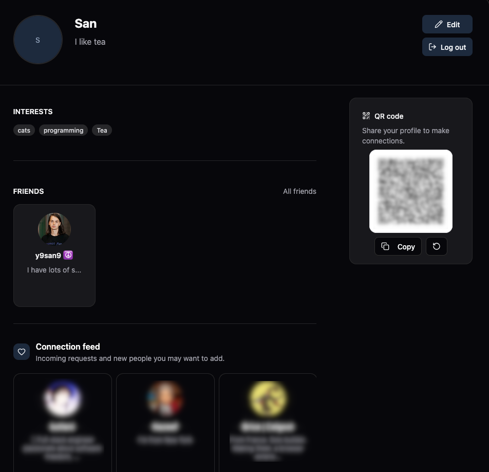

## Friendly Web

[](https://www.typescriptlang.org/)
[](https://nextjs.org/)
[](https://tailwindcss.com/)

An official frontend for Friendly.

#### Idea and mission statement:
[Info and other knowledge](https://github.com/friendly-social/knowledge/blob/main/IDEA.md)

#### Contribution information:
Please read if you are interested in contributing!
[CONTRIBUTION](docs/CONTRIBUTION.md)

## Support table

| Feature               | FED                                                                                                                  | State   |
| --------------------- | -------------------------------------------------------------------------------------------------------------------- | ------  |
| Profile               | [fed-00002-profile-mvp.md](https://github.com/friendly-social/knowledge/tree/main/fed/fed-00002-profile-mvp.md)      | Done    |
| Profile edit          | [fed-00001-profile-edit.md](https://github.com/friendly-social/knowledge/tree/main/fed/fed-00001-profile-edit.md)    | Done    |
| Linking email         | [fed-00006-email.md](https://github.com/friendly-social/knowledge/blob/main/fed/fed-00006-email.md)                  | -       |
| Network profiles      | _In progress_                                                                                                        | -       |
| Add friend using QR   | [fed-00004-add-friend-qr.md](https://github.com/friendly-social/knowledge/blob/main/fed/fed-00004-add-friend-qr.md)  | Done    |
| Feed                  | [fed-00003-feed.md](https://github.com/friendly-social/knowledge/blob/main/fed/fed-00003-feed.md)                    | Done    |
| Blocking QR           | [fed-00005-blocking-qr.md](https://github.com/friendly-social/knowledge/blob/main/fed/fed-00005-blocking-qr.md)      | Done    |

## Quick start

```bash
git clone https://github.com/friendly-social/web.git
cd web

pnpm install
pnpm dev
```

## Current progress:

